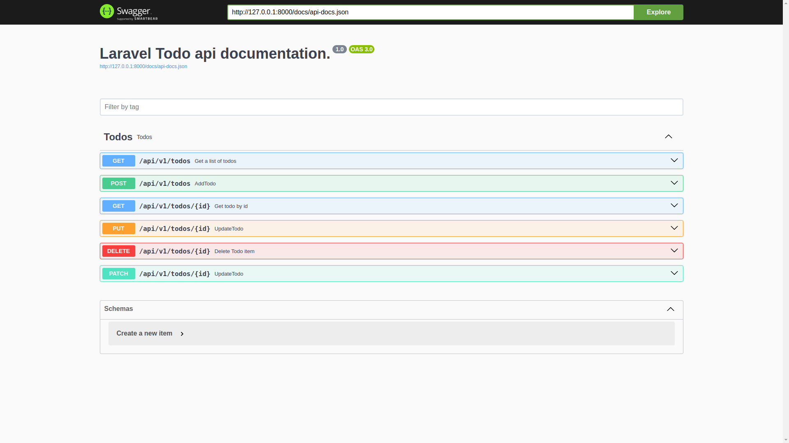

# [TodoApp](https://github.com/rahulrajdahal/todo-laravel). Visualize your forecast today

Create, Update and view your tasks.

- Create Tasks
- Complete Tasks.

## Preview

[](https://github.com/rahulrajdahal/todo-laravel)

## 🏗 Development Guide

### 1. clone the repository

```sh
git clone https://github.com/rahulrajdahal/todo-laravel.git
```

### 2. Install Dependencies

#### npm

```sh
cd todo-laravel && composer install
```

### 3. Connect to your API 💾

- Copy **.env.example** file.
- Rename to **.env.example copy** file.
- Update key value pairs.

### 4. Prepare and migrate the database

```sh
php artisan migrate
```

### 5. Run development server

```sh
php artisan serve
```

## 🚀 Project Structure

Inside of project [Todo](https://github.com/rahulrajdahal/todo-laravel), you'll see the following folders and files:

```text
/
├── app/
|   ├── Models/
│   │   └── Model.php
│   ├── Http
│   │   └── Controllers
│   │       └── Controller.php
│   └── Providers
├── config/
│   └── config.php
├── database/
│   ├── factories
│   │   └── Factory.php
│   ├── migrations
│   │   └── my_migration_table.php
│   ├── seeders
│   │   └── seeder.php
├── tests/
│   ├── Feature
│   │   └── FeatureTest.php
│   ├── Unit
│   │   └── UnitTest.php
│── composer.json
└── package.json
```
